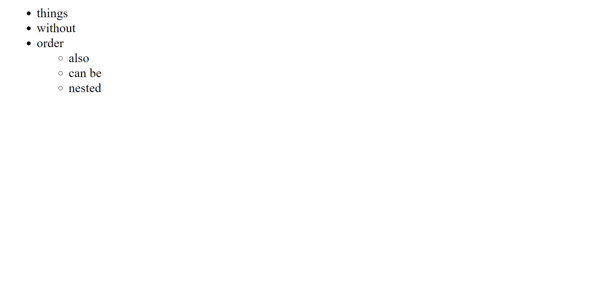
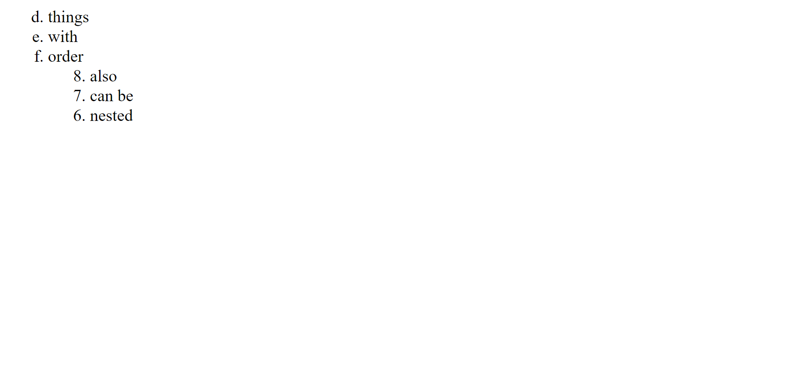
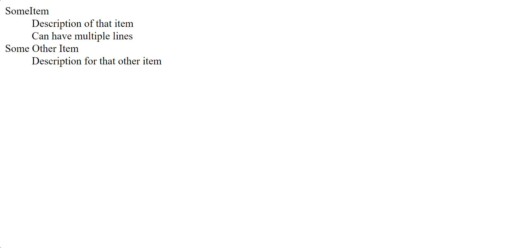
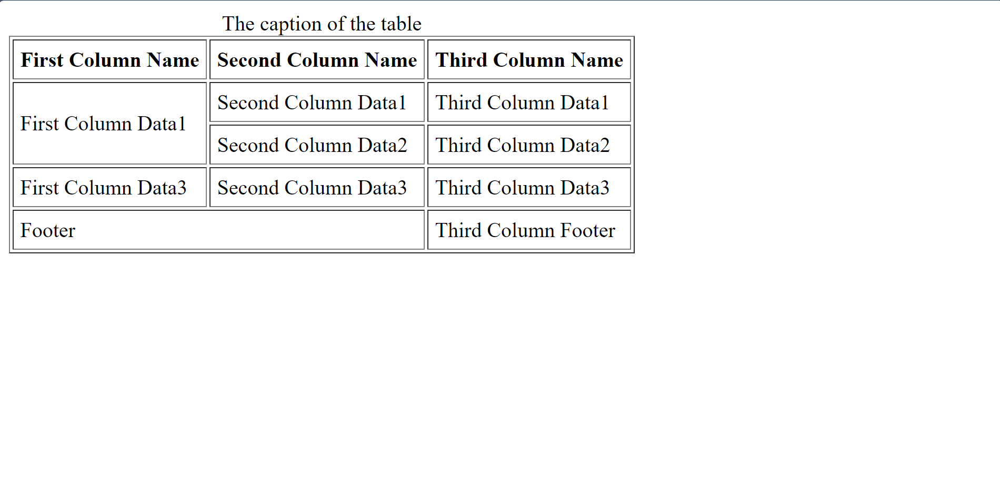
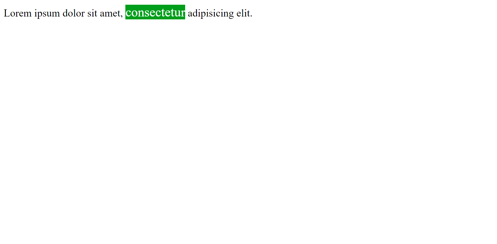
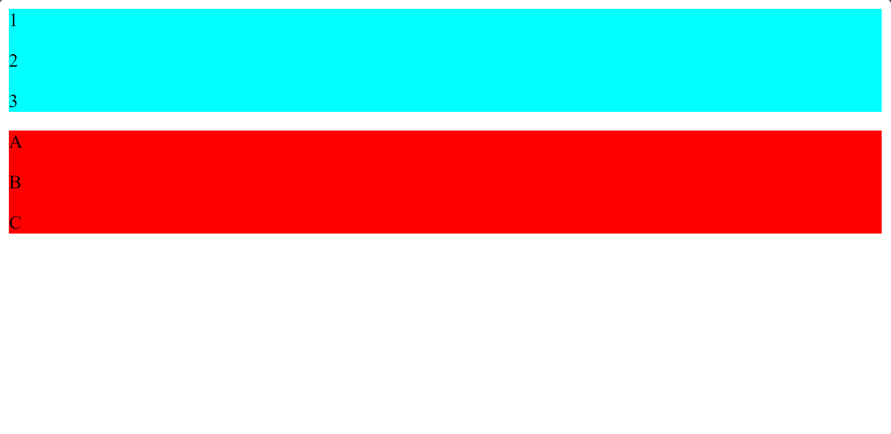
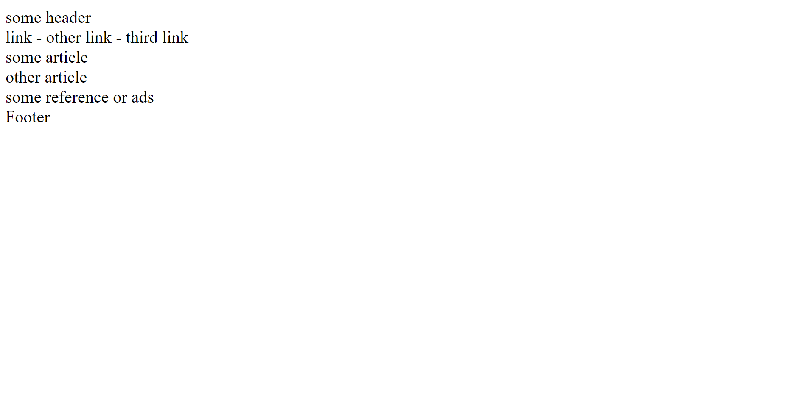
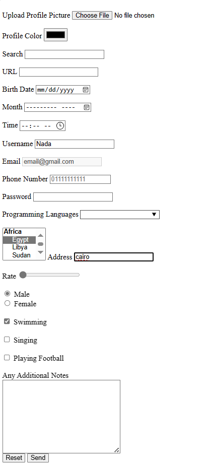

# HTML Tutorial

  Here we will learn the HTML Elements, Its types, and usage.

## Agenda

- [What is HTML?](https://github.com/nadamedhat27/Full-Stack/tree/main/Front-End/HTML#what-is-html)
- [Why HTML?](https://github.com/nadamedhat27/Full-Stack/tree/main/Front-End/HTML#why-html)
- [General in writing the code](https://github.com/nadamedhat27/Full-Stack/tree/main/Front-End/HTML#general-in-writing-the-code)
- [General to all elements](https://github.com/nadamedhat27/Full-Stack/tree/main/Front-End/HTML#general-to-all-elements)
- [Comments](https://github.com/nadamedhat27/Full-Stack/tree/main/Front-End/HTML#comments)
- [DOCTYPE](https://github.com/nadamedhat27/Full-Stack/tree/main/Front-End/HTML#doctype)
- [HTML Element](https://github.com/nadamedhat27/Full-Stack/tree/main/Front-End/HTML#html-element)
  - [Head Element](https://github.com/nadamedhat27/Full-Stack/tree/main/Front-End/HTML#head-element)
    - [Meta Elements](https://github.com/nadamedhat27/Full-Stack/tree/main/Front-End/HTML#meta-elements)
    - [Title Element](https://github.com/nadamedhat27/Full-Stack/tree/main/Front-End/HTML#title-element)
  - [Body Element](https://github.com/nadamedhat27/Full-Stack/tree/main/Front-End/HTML#body-element)
    - [Heading Elements](https://github.com/nadamedhat27/Full-Stack/tree/main/Front-End/HTML#heading-elements)
    - [Paragraph Element](https://github.com/nadamedhat27/Full-Stack/tree/main/Front-End/HTML#paragraph-element)
    - [Formatting Elements](https://github.com/nadamedhat27/Full-Stack/tree/main/Front-End/HTML#formatting-elements)
    - [Anchors](https://github.com/nadamedhat27/Full-Stack/tree/main/Front-End/HTML#anchors)
    - [Images](https://github.com/nadamedhat27/Full-Stack/tree/main/Front-End/HTML#images)
    - [Lists](https://github.com/nadamedhat27/Full-Stack/tree/main/Front-End/HTML#lists)
    - [Tables](https://github.com/nadamedhat27/Full-Stack/tree/main/Front-End/HTML#tables)
    - [Span Element](https://github.com/nadamedhat27/Full-Stack/tree/main/Front-End/HTML#span-element)
    - [Break Element](https://github.com/nadamedhat27/Full-Stack/tree/main/Front-End/HTML#break-element)
    - [Horizontal Rule](https://github.com/nadamedhat27/Full-Stack/tree/main/Front-End/HTML#horizontal-rule)
    - [Divisions](https://github.com/nadamedhat27/Full-Stack/tree/main/Front-End/HTML#divisions)
    - [Entities](https://github.com/nadamedhat27/Full-Stack/tree/main/Front-End/HTML#entities)
    - [Semantic Elements](https://github.com/nadamedhat27/Full-Stack/tree/main/Front-End/HTML#semantic-elements)
    - [Dev Break :blush:](https://github.com/nadamedhat27/Full-Stack/tree/main/Front-End/HTML#dev-break-blush)
    - [Audio](https://github.com/nadamedhat27/Full-Stack/tree/main/Front-End/HTML#audio)
    - [Video](https://github.com/nadamedhat27/Full-Stack/tree/main/Front-End/HTML#video)
    - [Forms](https://github.com/nadamedhat27/Full-Stack/tree/main/Front-End/HTML#forms)
    - [Other Elements](https://github.com/nadamedhat27/Full-Stack/tree/main/Front-End/HTML#other-elements)
- [Accessibility](https://github.com/nadamedhat27/Full-Stack/tree/main/Front-End/HTML#accessibility)

----------------------------------------------------------------

- ## What is HTML?

  - A short for Hyper Text Markup Language.
  - It's the backbone for building any webpage and it has the main content of the webpages.
  - There are 2 versions of HTML (4, 5) **covered in this tutorial**

- ## Why HTML?
  
  If you are looking for working as a Front-end Developer, Back-end Developer or Mobile Developer or working with reports then HTML will be a great thing to start with.

- ## General in writing the code

  - We can write the code in more than one line for clarity.
  - any spaces between words you write will be translated in the webPage as a single space only.

- ## General to all elements
  
  - Our code in html is case insensitive.
  - Every element has opening and closing tags like  `<html>` (opening) `</html>` (closing).
  - But there are elements that is self closed like `<meta />` and `<b />`.
  - All elements can have attributes, some of them are specialized to a specific element and the other are general to all elements.  <br />
  Some general attributes like ( name, class, id ).

  - Attributes can be added to any element like this `<element attribute="value">`, and not always we need the value.

  - No difference between single and double quotes in writing the values of attribute, both are same in the webPage, and if the value is only one word you can discard quotes.

    ```html
    <meta charset=u tf-8 />

    <meta http-equiv='X-UA-Compatible' content='IE=edge' />

    <meta name="description" content="This is my toturial, learn html easily." />
    ```

    But if we have **SPACES** in the value of an attribute, then we must use quotes (single or double).

----------------------------------------------------------------

- ## Comments

   Comments are written like:
  
    ```html
    <!-- Comments --> 
    ```

    and this for both single and multi-line comments
    and we write them when we write code that isn't completely clear or new to this language, Comments helps you and your teammates to understand your code very well.

----------------------------------------------------------------

- ## DOCTYPE
  
   DocType is not an element but it's an instruction for
    the browser, for example

    ```html
    <!DOCTYPE html>
    ```

    is referred for HTML5 standard mode and this line is important (Must be written) and without it browser will run the page in [quirks mode](https://developer.mozilla.org/en-US/docs/Web/HTML/Quirks_Mode_and_Standards_Mode).

----------------------------------------------------------------

- ## HTML Element

    The `<html>` tag is the root of any webPage.

    It's written like:

    ```html
    <html>
      Some Content  
    </html> 
    ```

    it has 2 elements **ONLY** (Head and Body).

----------------------------------------------------------------

- ## Head Element

    The `<head>` element has all meta data about the page (Like Styling, Scripts, and any addition data).

    It's written like:

    ```html
    <head>
      Some Content
    </head> 
    ```

    And now we will learn the elements written inside the Head Element.

  ----------------------------------------------------------------

  - ### Meta Elements

      The `<meta>` tag is self closed tag that has the additional data about the webPage and insturctoins, it has some attributes (has some additional characteristics about that element) like charset or content.

      ```html
      <meta charset=u tf-8 />
      ```

      Here charset attribute holds the type of language you want to use (utf-8 holds English and Arabic).

      ```html
      <meta name="description" content="This is my toturial, learn html easily." />

      <meta name='viewport' content='width=device-width, initial-scale=1' />
      ```

      The name attribute can be description like this which holds the description that appears in searching and under the title of the page.

  ----------------------------------------------------------------

  - ### Title Element

      the Title element holds the title of the page that appears above in the tabs bar.

      It's written like:

      ```html
      <title>
        Some title
      </title>
      ```

----------------------------------------------------------------

- ## Body Element
  
  The Body element has all contents of the webPage

  like `<p>`, `<dev>` or anything

  ----------------------------------------------------------------

  - ### Heading Elements

      Headings are ordered from h1 (Biggest) to h6 (Smallest), h1 is the first level of headings and is the biggest title and when we want to add subtitles to it we use h2 which is level 2 and so on.

      It's written like:

      ```html
      <h1>heading 1</h1>
      <h2>heading 2</h2>
      <h3>heading 3</h3>
      <h4>heading 4</h4>
      <h5>heading 5</h5>
      <h6>heading 6</h6>
      ```

      The output is:

      

  ----------------------------------------------------------------

  - ### Paragraph Element
  
      the `<p>` element is a Block Element that means it have special spaces above, below, right and left, like an unseen box which makes the content clear for the user to read in the webPage.

      Is written like:

      ```html
      <p>
        Some Content
      </p>
      ```

      Examples:

      ```html
      <p class="one"> this is my paragraph </p>
      <p class='two' hidden> this is my second paragraph </p>
      ```

      The output is:

      

      Note: The second paragraph is not visible because it has an attribute called hidden.

  ----------------------------------------------------------------

  - ### Formatting Elements
    - the `<b>` element is for bold text and for designing text style only.

      Like:

      ```html
      <p id="Formatting-first-example"> This is my <b> Toturial </b>, Welcome </p>
      ```

    - the `<strong>` element is for important bold text and the user should be aware of it.

      Like:

      ```html
      <p id="Formatting-second-example"> This is my <strong> Toturial </strong>, Welcome </p>
      ```

    - the `<i>` element is for italic text.

      Like:

      ```html
      <p id="Formatting-third-example"> This is my <i> Toturial </i>, Welcome </p>
      ```

    - the `<em>` element is for important italic text. 

      Like:

      ```html
      <p id="Formatting-fourth-example"> This is my <em> Toturial </em>, Welcome </p>
      ```  

      the difference between `<i>` and `<em>` is the same difference between `<strong>` and `<b>`.

    - the `<mark>` element is for marked text.

      Like:

      ```html
      <p id="Formatting-fifth-example"> This is my <mark> Toturial </mark>, Welcome </p>
      ```

    - the `<u>` element is for underlined text.

      Like:

      ```html
      <p id="Formatting-sixth-example"> This is my <u> Toturial </u>, Welcome </p>
      ```

    - the `<small>` element is for the text that we don't want the user to concentrate on but still it should exist there like "Copyrights".

      Like:

      ```html
      <p id="Formatting-seventh-example"> <small> Copyright </small> </p>
      ```

    - the `<del>` element is for deleted text and is used to show some text that was wrong and you corrected it , like discounts.

      Like:

      ```html
      <p id="Formatting-eighth-example"> This is my <del> Toturial </del> Course, Welcome </p>
      ```

    - the `<ins>` element is for inserted text and is used to show some new added text.

        Like:

      ```html
      <p id="Formatting-ninth-example"> This is my <ins> Course </ins>, Welcome </p>
      ```

    - the `<sub>` element is subscript like atoms number in a compound.

      Like:

      ```html
      <p id="Formatting-tenth-example"> NH<sub>3</sub> </p>
      ```

    - the `<sup>` element is superscript like Power.

      Like:

      ```html
      <p id="Formatting-eleventh-example"> 2<sup>3</sup> = 8 </p>
      ```

  ----------------------------------------------------------------

  - ### Anchors

      the `<a>` element can hold an anchor or link to another page, it's inline element
      Format:

      ```html
      <a href="link to be added">link text</a>
      ```

      Example:

      ```html
      <a id="Anchor-first-example" href="https://www.amazon.eg/" target="_blank" title="a link to amazon website">amazon</a>
      ```

      the attribute target describes were to open this link.

      the attribute title is a global attribute that appears when hover that element.

      In href attribute you can put a local link in your pc.

      ```html
      <a id="Anchor-second-example" href="test.html" target="_blank" title="a link to test.html">Test</a>
      ```

      If you put an email address the link well open any mail application to contact this email address.

      ```html
      <a id="Anchor-third-example" href="mailto:someEmail@gmail.com" title="Contact Me">Contact</a>
      ```

  ----------------------------------------------------------------

  - ### Images

    the `` element is for adding images to the page, it's inline element.

    Format:

    ```html
    
    ```

    - external link:

      ```html
      
      ```

      you can use two attributes (Width and Height) but I don't recommend that, the better is to customize them in CSS.

    - local path:

      ```html
      
      ```

      We just added the folder name that is besides the html file on the left then the name of the image after it including the extension (.png).

    - what if my image is outside the folder holding the html file?

      ```html
      
      ```

      But not a good choice to make it like that.

  ----------------------------------------------------------------

  - ### Lists 
    it's a block elements

    1- UnOrdered List : Created by element `<ul>` and inside it some list items `<li>`.

    ```html
    <ul id="List-first-example">
      <li>things</li>
      <li>without</li>
      <li>order
        <ul>
          <li>also</li>
          <li>can be</li>
          <li>nested</li>
        </ul>
      </li>
    </ul>
    ```

    Output:

    

    2- Ordered List : Created by element `<ol>` and inside it some list items `<li>`.

    ```html
    <ol id="List-second-example" type="a">
      <li value="4">things</li>
      <li>with</li>
      <li>order
        <ol reversed start="8">
          <li>also</li>
          <li>can be</li>
          <li>nested</li>
        </ol>
      </li>
    </ol>
    ```

    Output:

    

    - attribute reversed : reverses the order of the list items.

    - attribute start : starts the list numbers from specific number.

    - attribute value : you can put a value in first `<li>` element to start from specific value by it's index.

    - attribute type : specifies the type of the list numbering.

      types : ( 1 [Numeric], A [Alphabetical Capital Letters], a [Alphabetical Small Letters], I [Romanichal Capital Letters], i [Romanichal Small Letters]).

    - lists can be nested.

    3- Description List : Created by element `<dl>` and used for writing a list with description for every item.

    ```html
    <dl id="List-third-example">
      <dt> SomeItem </dt>
      <dd> Description of that item </dd>
      <dd> Can have multiple lines</dd>
      <dt> Some Other Item </dt>
      <dd> Description for that other item </dd>
    </dl>
    ```

    Output:

    

      inside it:

      1- `<dt>` (Data Title) : for identifying the item.

      2- `<dd>` (Data Details) : for identifying the details for that item.
  
  ----------------------------------------------------------------

  - ### Tables

    it's a block element

    - the `<table>` element is used to make a table in the web page, it's a block element.

    Format:

    ```html
    <table class="Tables-first-example" border="1" cellpadding="5px">
      <thead>
        <caption> The caption of the table </caption>
        <tr>
          <th> First Column Name </th>
          <th> Second Column Name </th>
          <th> Third Column Name </th>
        </tr>
      </thead>
      <tbody>
        <tr>
          <td rowspan="2"> First Column Data1 </td>
          <td> Second Column Data1 </td>
          <td> Third Column Data1 </td>
        </tr>
        <tr>
          <td> Second Column Data2 </td>
          <td> Third Column Data2 </td>
        </tr>
        <tr>
          <td> First Column Data3 </td>
          <td> Second Column Data3 </td>
          <td> Third Column Data3 </td>
        </tr>
      </tbody>
      <tfoot>
        <tr>
          <td colspan="2"> Footer </td>
          <td> Third Column Footer </td>
        </tr>
      </tfoot>
    </table>
    ```

    Output:

    
    - SubElements (All is optional but recommended for organizing the table):

      - `<thead>` : is for adding header to the table.

      - `<tbody>` : is for adding data to the table.

      - `<tfoot>` : is for adding footer to the table.

      - `<caption>` : is for adding some caption to the table, it's like a title that explains what the table is about.

    - SubSubElements:

      - `<th>` : is for adding header to the table, it makes the header in a special formatting from the rest rows.

      - `<tr>` : is for adding a new row.

      - `<td>` : is for adding data in that row depending on the number of columns expected.

    - Attributes (not recommended because it has alternates in CSS):

      - border : for making a border.

      - cellpadding : for making a padding.

    - Merging :

      - Columns : remove all of the columns that should be merged except one then write the attribute colspan and the number of these columns.

      - Rows : remove all of the rows that should be merged except one then write the attribute rowspan and the number of these rows.

  ----------------------------------------------------------------

  - ### Span Element

    It's inline element.

    Is used when you want to style a word or a part of a div or any content.

    Format:

    ```html
    content <span> middle content </span> other content
    ```

    Example:

    ```html
    <p>Lorem ipsum dolor sit amet, <span style="color: rgb(255, 255, 255);font-size: 20px; background-color: rgb(0, 158, 26);">consectetur</span> adipisicing elit.</p>
    ```

    Output:

    

  ----------------------------------------------------------------

  - ### Break Element

    It's a Self closing tag (Empty tag).

    Is used to make a new line in the paragraph or any content.

    Format:

    ```html
    content <br /> other content
    ```

    Or

    ```html
    content <br> other content 
    ```

    Example:

    ```html
    <p> Lorem ipsum,<br /> dolor sit amet consectetur adipisicing elit.</p>
    ```

  ----------------------------------------------------------------

  - ### Horizontal Rule

    It's a block element and it's a self closing tag (Empty tag).

    Is used to make a horizontal line between elements
    Format: `<hr>` or `<hr />`.

  ----------------------------------------------------------------

  - ### Divisions

    Is a block element

    Is used to contain other elements that are related to each other and make your favorite styling on it without repetition.

    You can use classes and ids to specify each div.

    Example:

    ```html
    <div class="Numbers" style="background-color: aqua;">
        <p> 1 </p>
        <p> 2 </p>
        <p> 3 </p>
    </div>

    <div class="Alphabets" style="background-color: rgb(255, 0, 0);">
        <p> A </p>
        <p> B </p>
        <p> C </p>
    </div>
    ```

    Output:

    

  ----------------------------------------------------------------

  - ### Entities

    It's a method to print any tag or any special character like it was written in the code
    - `<` : `&lt;`
    - `>` : `&gt;`
    - `&` : `&amp;`
    - also `&asymp;` -> &asymp; ,  `&copy;` -> &copy;,  `&quot;` -> &quot; and more..

    Examble:

    ```html
    <div> A paragraph &asymp; is written by &lt;p&gt; &quot;element&quot; &copy;</div>
    ```

    Output:

    

  ----------------------------------------------------------------

  - ### Semantic Elements

    From HTML5 and all of them are block elements.

    They are elements that can specify what the content is more than divisions by only one word and without the need of classes like divisions.

    - in the previous if you want to create navigation bar :

      ```html
      <div class="nav"> content </div>
      ```

    - but now you can just type :

      ```html
      <nav> content </nav>
      ```

    And then, you can style it easily and quickly without any conflicts and there is more than the examples below.

    Note: they are not different in performance they just have specific name, I mean the elements in the example below will not be styled at all.

    ```html
    <header> some header </header>
    <nav> link - other link - third link</nav>
    <section>
        <section>
            <article>
                some article
            </article>
            <article>
                other article
            </article>
        </section>
        <aside>
            some reference or ads
        </aside>
    </section>
    <footer> Footer </footer>
    ```

    Output:

    

  ----------------------------------------------------------------

  - ### Dev Break :blush:

    Let's Make some Simple page with divisions and classes only.

    ```html
    <div class="header">
          <h2> Logo </h2>
          <ul>
              <li> Home </li>
              <li> About </li>
              <li> Contact </li>
              <li> Favorites </li>
              <li> For You </li>
          </ul>
      </div>
      <hr>
      <div class="navigation">
          <ul>
              <li>link</li>
              <li>link</li>
              <li>link</li>
              <li>link</li>
              <li>link</li>
              <li>link</li>
              <li>link</li>
          </ul>
      </div>
      <hr>
      <div class="content">
          <div class="figure">
              
              <p> Some Caption </p>
          </div>
      </div>
      <div class="sidebar"> SideBar </div>
      <hr>
      <div class="footer"> Footer </div>
      ```

      If you see here, we need to provide a class for everty section of the page.

      Output:

      .png)

      Now, Let's make the same simple page using semantic elements.

      ```html
      <header>
          <h2> Logo </h2>
          <ul>
              <li> Home </li>
              <li> About </li>
              <li> Contact </li>
              <li> Favorites </li>
              <li> For You </li>
          </ul>
      </header>
      <hr>
      <nav>
          <ul>
              <li>link</li>
              <li>link</li>
              <li>link</li>
              <li>link</li>
              <li>link</li>
              <li>link</li>
              <li>link</li>
          </ul>
      </nav>
      <hr>
      <section>
          <figure>
              
              <figcaption> Some Caption </figcaption>
          </figure>
      </section>
      <aside> SideBar </aside>
      <hr>
      <footer> Footer </footer>
      ```

      Here, by using the semantic elements we decreased our usage of the classes and the code now is more simple.

      Output:

      .png)

      And also, the final view is the same. So, using semantic elements is very important.
  
  ----------------------------------------------------------------

  - ### Audio

    It's inline element.

    It's used to include audio in the page.

    Format:

    ```html
    <audio src="the link of the audio (online or local)" type="the mime type of the audio (you can search for the common mime types or the specific type you use easily)"></audio>
    ```

    - You can also include more than one source (because not all browsers support all types of audio) by using `<source>` subElement like the example below.
  
    - In the audio element you should write the attribute [ controls ] to show some controls like stopping button, volume control and some other options, but without that attribute the audio will not appear.

    - There is an attribute called [ autoPlay ] which plays the audio whenever the page loads (not working sometimes).

    - The [ loop ] attribute is used to get the audio play again when it finishes.

    - The [ muted ] attribute is used to mute the audio.

    - If the browser doesn't support the audio tag the sentence below will appear instead of it.

    Example:

    ```html
    <audio controls autoplay loop muted src="http://commondatastorage.googleapis.com/codeskulptor-demos/DDR_assets/Kangaroo_MusiQue_-_The_Neverwritten_Role_Playing_Game.mp3" type="audio/mpeg">
        <source controls src="http://commondatastorage.googleapis.com/codeskulptor-assets/Evillaugh.ogg" type="audio/ogg">
        <source controls src="http://commondatastorage.googleapis.com/codeskulptor-assets/week7-button.m4a" type="audio/m4a">
        Your Browser Doesn't support the audio tag
    </audio>
    ```

  ----------------------------------------------------------------

  - ### Video

    It's inline element.

    All things written for audio also apply on video element, but there is some additional attributes:

    - The attribute [ poster ] : is used to put a temporary image on the video in the page until the video finishes loading.

    - The subElement `<track>` is used to help people with disabilities to watch the video like blind or mute people by creating subtitles on the video.

    - The attribute [ src ] : the link to the file, the extension must be .vtt.

    - The attribute [ kind ] : what this file is for, (captions, chapters, descriptions, metadata, subtitles).
  
    - The attribute [ srclang ] : the language of the track, just the abbreviation.

    - attribute [ label ] : the name of that language.

    - the attribute [ preload ] : this attribute can lead to the best user experience, (auto, metadata, none). 

    Example:

    ```html
    <video controls muted autoplay loop width="100%" height="500px" poster="images/Ain_Shams_logo.png" preload="none">
        <source src="./media/Search_Google_preview.mp4" type="video/mp4">
        Your Browser Doesn't support the video tag
        <track src="file_en.vtt" kind="subtitles" srclang="en" label="English">
        <track src="file_it.vtt" kind="subtitles" srclang="it" label="Italian">
    </video>
    ```
  
  ----------------------------------------------------------------

  - ### Forms

    it's a block element
    - the attribute [ Action ] : this attribute is responsible for sending data submitted to a specific destination file

    - the attribute [ Method ] : this attribute is specifies the method to send the data to the destination file, there is a lot of methods but the most common are (GET, POST), GET is sending the data and prints it in the URL above while POST is sending the data without printing it in the URL above.

    - the attribute [ novalidate ] : this attribute is used to disable validation of the form which is useful in the testing stage.

    - the attribute [ target ] : this attribute is used to tell the browser where to receive the respond after submitting the form and it's values are (_blank,_parent, _self, _top, or other file path).
    it's used to create a form, and you can put any element in the `<form>` element like `<div>` and `<p>`, but there is some elements that are preferred to be in this element:
      - the `<input>` element : it's inline element and self closing element.

        this is most important and used element in the form, it's default output is textbox

        - the attribute [ type ] : specifies what this input is for, (button, checkbox, color, date, datetime, datetime-local, email, file, hidden, image, month, number, password, radio, range, reset, search, submit, tel, text, time, url, week)

        - the attribute [ required ] : this will not allow the user to submit the form data without typing anything in that input field

        - the attribute [ placeholder ] : this will appear inside the input field, you can type anything that helps the user to write the needed data well, when the user starts typing the placeholder will be invisible

        - the attribute [ value ] : this attribute makes the input field hold some value (default value, old value) and will be visible to the user and he can edit it, and if you type it on the submit button the word submit will be changed to what you written

        - the attribute [ name ] : specifies the name of the input field before sending the data to the destination file, this helps the destination file to make difference between fields.

        - the attribute [ readonly ] : this makes the field read only, and used when there is some info the user need to see but cannot change it and the data of that field will be sent in the request successfully.

        - the attribute [ disabled ] : this makes the field read only, and used when there is some info the user need to see but cannot change it and the data of that field will not be sent in the request.

        - the attribute [ autofocus ] : this makes the browser focus on that field whenever the page loads.

        - the attribute [ minlength ] : used with the text type input, makes a constrain on the user to write at least the minimum length of characters. 

        - the attribute [ maxlength ] : used with the text type input, makes a constrain on the user to write at much the maximum length of characters. 

        - the attribute [ checked ] : used with radio type input, makes that radio button field checked initially.

      - the `<label>` element : it's inline element
          this element describes some info about the input element after it.

      - the `<select>` element : it's inline element

        this element makes a drop down list of options to select from. like menu for example.

        - the attribute [ multiple ] : this allows the user to select more than one option by selecting them with the control button on the keyboard.

        - the attribute [ selected ] : this makes that field of options is selected automatically when the page loads.

        - the `<opiongroup>` element : is holding a group of options of the list.

        - the `<option>` element : is holding every single option in the list.

      - the `<textarea>` element : it's inline element

        this element allows the user to write as much as he would like and with a resizable area for editing.

        - the attribute [ cols ] : this gives the text area the size of columns used in it initially and the user can change it by dragging the bottom right corner to left and right.

        - the attribute [ rows ] : this gives the text area the size of rows used in it initially and the user can change it by dragging the bottom right corner to up and down.

      - the `<datalist>` element : it's inline element
        this element is similar to the `<select>` element except that:

        - must be an input element before this element holding an attribute called list with any value and then giving an id to the datalist element with the same value.

        - it's options doesn't need closing tags.

        - the user can search in this list by typing in this field some characters.

          Example: if we type the character "r" the result will be (JavaScript, Ruby, Dart)
  
    - Notes:

      - the radio input options must have the same name, if we didn't do that, the user can select both of them.

      - if we want to link the label with it's input field we can do like:

        ```html
        <div>
            <input id="m" type="radio" name="gender" value="male" checked>
            <label for="m">Male</label>
        </div>
        ```

        and now the user can click the label and automatically select it's input field.

        also this is applied to the other input fields.

    Examples:

    ```html
    <form action="distination.php" method="get" novalidate target="_top">
        <div>
            <input type="hidden" required name="user-id">
        </div>
        <br>
        <div>
            <label>Upload Profile Picture</label>
            <input type="file" name="file">
        </div>
        <br>
        <div>
            <label>Profile Color</label>
            <input type="color" name="Color">
        </div>
        <br>
        <div>
            <label>Search</label>
            <input type="search" name="search">
        </div>
        <br>
        <div>
            <label>URL</label>
            <input type="url" name="url">
        </div>
        <br>
        <div>
            <label>Birth Date</label>
            <input type="date" name="date">
        </div>
        <br>
        <div>
            <label>Month</label>
            <input type="month" name="month">
        </div>
        <br>
        <div>
            <label>Time</label>
            <input type="time" name="time">
        </div>
        <br>
        <div>
            <label>Username</label>
            <input type="text" required placeholder="like: myusername12" value="Nada" name="userName" readonly>
        </div>
        <br>
        <div>
            <label>Email</label>
            <input type="email" name="email" value="email@gmail.com" disabled>
        </div>
        <br>
        <div>
            <label>Phone Number</label>
            <input type="number" name="phoneNumber" min="01000000000" max="100000000000" step="20" placeholder="01111111111">
        </div>
        <br>
        <div>
            <label>Password</label>
            <input type="password" required name="pass" minlength="10" maxlength="20">
        </div>
        <br>
        <div>
            <label> Programming Languages</label>
            <input list="programming" name="proglang">
            <datalist id="programming">
                <option value="JavaScript">
                <option value="Scala">
                <option value="C">
                <option value="C#">
                <option value="C++">
                <option value="Python">
                <option value="PHP">
                <option value="Java">
                <option value="Ruby">
                <option value="Dart">
            </datalist>
        </div>
        <br>
        <div>
            <select name="country" id="country" multiple>
                <optgroup label="Africa">
                    <option value="egypt" selected>Egypt</option>
                    <option value="Libya">Libya</option>
                    <option value="Sudan">Sudan</option>
                </optgroup>
                <optgroup label="Asia">
                    <option value="korea">Korea</option>
                    <option value="china">China</option>
                    <option value="japan">Japan</option>
                </optgroup>
                <optgroup label="Europe">
                    <option value="britan">Britan</option>
                    <option value="italy">Italy</option>
                    <option value="german">German</option>
                </optgroup>
            </select>

            <label>Address</label>
            <input type="text" value="cairo" name="address" autofocus>
        </div>
        <br>

        <div>
            <label>Rate</label>
            <input type="range" name="range" min="0" max="100" step="20" value="0">
        </div>
        <br>
        <div>
            <input type="radio" name="gender" value="male" checked>
            <label>Male</label>
        </div>
        <div>
            <input type="radio" name="gender" value="female">
            <label>Female</label>
        </div>
        <br>
        <div>
            <input type="checkbox" name="hobbies" value="swimming" checked>
            <label>Swimming</label>
        </div>
        <br>
        <div>
            <input type="checkbox" name="hobbies" value="singing">
            <label>Singing</label>
        </div>
        <br>
        <div>
            <input type="checkbox" name="hobbies" value="playfootball">
            <label>Playing Football</label>
        </div>
        <br>
        <label for="comment">Any Additional Notes</label> <br>
        <textarea name="comment" id="comment" cols="30" rows="10"></textarea>
        <br>
        <input type="reset" value="Reset">
        <input type="submit" value="Send">
    </form>
    ```

    Output:

    

  ----------------------------------------------------------------

  - ### Other Elements

    - Quote Element `<q>` is used to hold a quoted phrase like a proverb or an aphorism. `inline element`

    - Block Quote Element `<blockquote>` is also used to hold a proverb or an aphorism but is used when the proverb is a large paragraph. --> `block element`

    - Button Element `<button>` is also used create a simple button with a specific functionality. --> `inline-block element`

    - Word Break Opportunity Element `<wbr>` is used create a new line in the long paragraph when needed. --> `Empty element (Self closed)`

    - Bidirectional Isolation Element `<bdi>` is used to isolate the different directions of typing text. like typing English with Arabic with numbers. --> `inline element`

    - Code Element `<code>` is used to create a container for any code like JavaScript or Python. --> `inline element`

    - Pre-Formatted text Element `<pre>` is used to create a container like `p` for paragraphs and it understands and keeps all spaces you wrote. --> `block element`

    - Inline Frame Element `<iframe>` is used to create a mini window that contains another page (Inside our website or not). --> `inline element`

----------------------------------------------------------------

- ## Accessibility

    The accessibility of our website means it's accessible to everyone (including people with disabilities like blind users and people with poor vision).

    The accessibility world is vast and here are 2 videos on YouTube that explain how to work with accessibility as an introduction.

    [Introduction to Accessibility](https://youtu.be/lSqXHePabFo)

    [ARIA And Screen Readers](https://youtu.be/UnTxFfbpqco)
