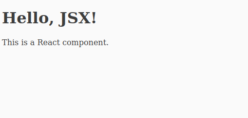

# React.js Tutorial 

* ## File structure
    * **node_modules**: This folder contains all the dependencies required for your project. It's generated by package managers like npm or Yarn.

    * **public**: This directory houses static assets and the main HTML file for your application. It's the entry point to your app.

    * **src**: This is where your application's source code lives. It's the most critical part of your project's structure.

        * **components**: This directory contains your reusable React components. It's often organized by functionality or feature.

        * **containers**: Container components that connect your application state (e.g., with Redux or Context API) to your presentation components.

        * **pages**: Each page of your application may have its own folder or file, helping you organize your routing.

        * **assets**: Application-specific assets that aren't directly related to your components.

        * **styles**: Your application's styles, typically organized by component or feature.

        * **utils**: Utility functions and helper files.

    * **App.js**: The main application component where you typically render your routes and layout.

    * **index.js**: The entry point for your React application, where you render the App component into the DOM.

    * **package.json**: Contains metadata about your project and its dependencies.

    * **package-lock.json (npm) / yarn.lock (Yarn)**: Auto-generated files for package version locking to ensure consistent dependencies.

    * **README.md**: Project documentation, providing an overview of your project and its setup.
      ```
      my-react-app/
        ├── node_modules/       # Auto-generated by npm or yarn, contains project dependencies
        ├── public/             # Static assets and entry point
        │   ├── index.html      # The main HTML file that loads your React app
        │   ├── manifest.json   # Web App Manifest (for progressive web apps)
        │   ├── robots.txt      # Rules for web crawlers
        │   ├── assets/         # Static files (e.g., images, fonts)
        │   ├── favicon.ico     # Favicon for your web application
        ├── src/                # Source code for your React app
        │   ├── components/     # React components
        │   │   ├── Header.js   # Example: Header component
        │   │   ├── Footer.js   # Example: Footer component
        │   ├── containers/     # Container components (often connected to Redux)
        │   ├── pages/          # Individual pages or route components
        │   ├── assets/         # Application-specific assets (e.g., logo)
        │   ├── styles/         # CSS or pre-processed style files (e.g., SCSS)
        │   ├── utils/          # Utility functions or helper files
        │   ├── App.js          # Main application component
        │   ├── index.js        # Entry point for React rendering
        ├── package.json        # Project metadata and dependencies
        ├── package-lock.json   # Auto-generated file for package version locking (npm)
        ├── yarn.lock           # Auto-generated file for package version locking (Yarn)
        ├── README.md           # Project documentation
        ```
----------------------------------------------------------------
* ## What is JSX?
    * JSX (JavaScript XML) is a syntax extension for JavaScript often used in React to describe what the UI should look like. It allows you to write HTML-like code within your JavaScript files. JSX is not a separate language; it's a syntactical extension that gets transpiled (converted) into regular JavaScript code before being executed in the browser.

    * Here's a simple example of JSX in a React component:
    
         ```javascript
        import React from 'react';
        
        function MyComponent() {
             return (
               <div>
                 <h1>Hello, JSX!</h1>
                 <p>This is a React component.</p>
               </div>
             );
           }
        
        export default MyComponent;
        ```
        The output is:
            <br />
            
    * In the example above, JSX is used to define the structure of the component. It looks like HTML, but it's actually JavaScript. JSX allows you to:
        1. **Create and define React elements**: In the example, `<div>`, `<h1>`, and `<p>` are all React elements, created with JSX.
        
        2. **Embed JavaScript expressions**: You can use curly braces `{}` to embed JavaScript expressions within JSX, allowing you to render dynamic content.
        
    *    For example:
    
         ```javascript
          import React from 'react';
          
          function Greeting(props) {
            return (
              <div>
                <h1>Hello, {props.name}!</h1>
                <p>Today is {new Date().toDateString()}</p>
              </div>
            );
          }
            ```
    * Before it's used in the browser, JSX code is transformed into regular JavaScript using a tool like Babel. The above JSX code will be transpiled into something like this:
      ```javascript
      function Greeting(props) {
        return React.createElement(
          "div",
          null,
          React.createElement(
            "h1",
            null,
            "Hello, ",
            props.name,
            "!"
          ),
          React.createElement(
            "p",
            null,
            "Today is ",
            new Date().toDateString()
          )
        );
      }
      ```
